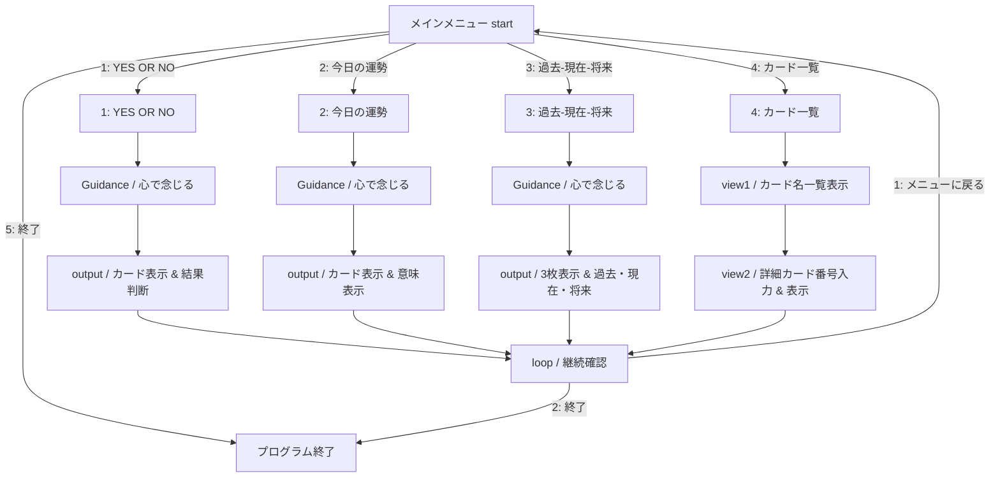

実行動画がありますので、是非チェックしてみてください。
https://x.com/kokaiyou111/status/2107297427665613076?s=20

# 説明
本ドキュメントは、制作したTarot.cの構成および工夫点をまとめた説明書です。

## 目次
(特定場所へのジャンプ)
- [画面一覧表](#画面一覧表)
- [工夫したこと](#工夫したこと)  

## 画面一覧表

|番目|内容|遷移|
|:---|:---:|:---|
|01|START[メインメニュー start]|01|
|02|MODE1[1: YES OR NO]|01->02|
|03|MODE2[2: 今日の運勢]|01->03|
|04|MODE3[3: 過去-現在-将来]|01->04|
|05|MODE4[4: カード一覧]|01->05|
|06|END[プログラム終了]|01->06|
|07|Guidance[Guidance / 心で念じる]|02->07, 03->07, 04->07|
|08|Output1[output / カード表示 & 結果判断]|02->07->08|
|09|Output2[output / カード表示 & 意味表示]|03->07->09|
|10|Output3[output / 3枚表示 & 過去・現在・将来]|04->07->10|
|11|View1[view1 / カード名一覧表示]|05->11|
|12|View2[view2 / 詳細カード番号入力 & 表示]|05->11->12|
|13|LoopCheck[loop / 継続確認]|08->13, 09->13, 10->13, 12->13|
|14|STARTへ戻る|13->01|
|15|プログラム終了|13->06|

## 工夫したこと
- 入力ミス（指示以外の数字、英文字、符号）を防止するLOOPを追加すること。
- メソッドをコメント付き、メンテナンス性上昇する。

 ---
2026年10月06日  
ZHAO YUJING(チョウ　ユウキョウ)
